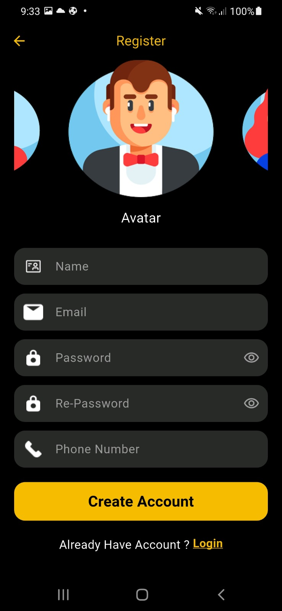
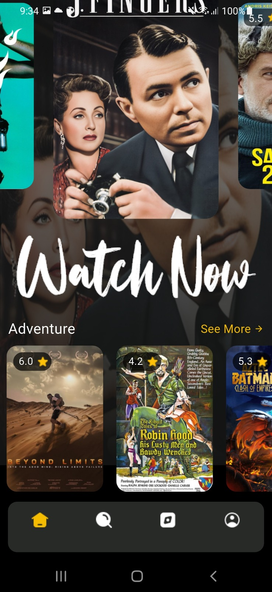
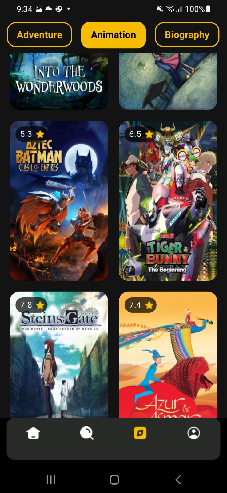
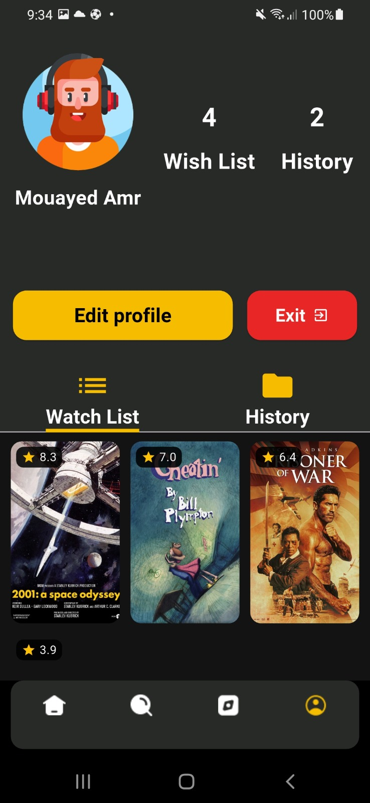
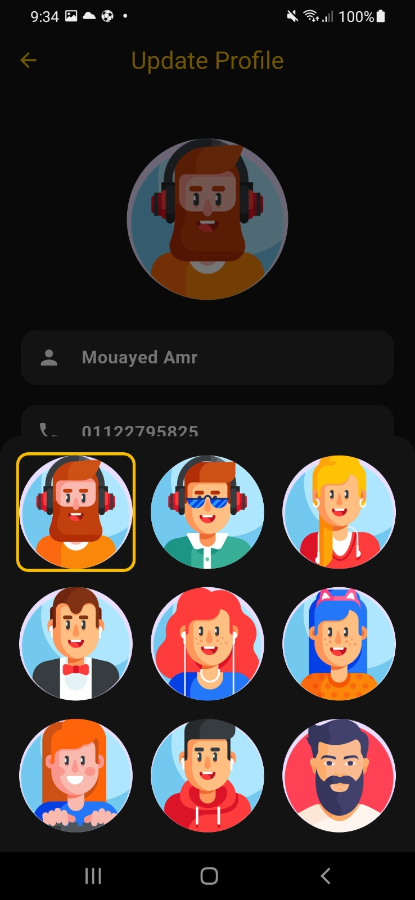

# 🎬 Movies App

A comprehensive Flutter application that allows users to explore, discover, and watch movies with detailed information about cast, summaries, genres, and more. The app features Firebase authentication, real-time movie updates, personalized watchlists, and viewing history.

## ✨ Features

### 🔐 Authentication System
- **Firebase Authentication** integration
- Secure login and registration
- Guest mode for browsing without account
- Password recovery functionality
- User profile management

### 🎯 Core Functionality
- **Real-time Movie Updates** - Fresh content every 10 seconds
- **Advanced Search** - Find movies by title, genre, or keywords
- **Genre Exploration** - Browse movies by specific categories
- **Detailed Movie Information** - Cast, crew, summaries, ratings, and more
- **Personalized Experience** - Watchlist and viewing history
- **Profile Management** - Edit profile information and preferences

### 📱 User Experience
- **Splash Screen** - Smooth app launch experience
- **Onboarding** - Interactive introduction to app features
- **Responsive Design** - Optimized for all screen sizes
- **Offline Support** - Browse cached content when offline

## Screenshots

### Authentication Features
| Login Screen                           | Signup Screen                            |
|----------------------------------------|------------------------------------------|
|       |  |

### App Introduction & Home
| Splash Screen                          | Introduction Screens                      | Home Screen                               |
|----------------------------------------|------------------------------------------|------------------------------------------|
|  |  |    |

### Movie Discovery & Profile
| Explore Screen                         | Profile Screen                            | Update Photo                             |
|----------------------------------------|------------------------------------------|------------------------------------------|
|   |     |  |

## 🛠️ Technical Features

### 🔥 Firebase Integration
- **Authentication** - Secure user login and registration
- **Cloud Firestore** - Real-time data synchronization
- **Storage** - User profile images and app data
- **Collections**:
  - `wishlist` - User's saved movies
  - `history` - Viewing history tracking
  - `user_profiles` - User account information

### 📊 Data Management
- **Real-time Updates** - Movies refresh every 10 seconds
- **Offline Caching** - Browse content without internet
- **Search Optimization** - Fast and accurate movie search
- **Genre Filtering** - Dynamic content categorization

### 🎨 UI/UX Features
- **Modern Design** - Clean and intuitive interface
- **Dark/Light Themes** - User preference support
- **Smooth Animations** - Enhanced user experience
- **Responsive Layout** - Works on all device sizes

## 🚀 Getting Started

### Prerequisites
- Flutter SDK (latest stable version)
- Firebase project setup
- Android Studio / VS Code
- Git

### Installation

1. **Clone the repository**
   ```bash
   git clone https://github.com/yourusername/movies-app.git
   cd movies-app
   ```

2. **Install dependencies**
   ```bash
   flutter pub get
   ```

3. **Firebase Setup**
   - Create a Firebase project
   - Enable Authentication and Firestore
   - Download `google-services.json` for Android
   - Download `GoogleService-Info.plist` for iOS
   - Place files in appropriate directories

4. **Run the app**
   ```bash
   flutter run
   ```

## 📱 App Structure

```
lib/
├── core/                 # Core functionality
│   ├── config/          # App configuration
│   ├── constants/        # App constants
│   ├── extensions/       # Dart extensions
│   ├── routes/          # Navigation routes
│   ├── services/        # API services
│   ├── theme/           # App theming
│   └── widgets/         # Reusable widgets
├── modules/             # Feature modules
│   ├── splash/          # Splash screen
│   ├── onBoarding/      # Introduction screens
│   ├── signIn/          # Login functionality
│   ├── signUp/          # Registration
│   ├── forgetPassword/  # Password recovery
│   ├── layout/          # Main app layout
│   ├── home/            # Home screen
│   ├── search/          # Search functionality
│   ├── Explore/         # Movie exploration
│   ├── moviedetails/    # Movie information
│   └── Profile/         # User profile
└── main.dart           # App entry point
```

## 🔧 Key Dependencies

- `firebase_core` - Firebase integration
- `firebase_auth` - Authentication
- `cloud_firestore` - Database
- `firebase_storage` - File storage
- `google_sign_in` - Google authentication
- `shared_preferences` - Local storage
- `sqflite` - Local database
- `path_provider` - File system access

## 🎯 Features in Detail

### Movie Discovery
- **Trending Movies** - Popular and current releases
- **Genre Categories** - Action, Comedy, Drama, Horror, Sci-Fi, etc.
- **Advanced Search** - Filter by year, rating, genre, cast
- **Recommendations** - Personalized movie suggestions

### Movie Information
- **Detailed Descriptions** - Full plot summaries and introductions
- **Cast & Crew** - Complete actor and director information
- **Ratings & Reviews** - User and critic ratings
- **Trailers & Screenshots** - Visual content previews
- **Technical Details** - Runtime, release date, language, etc.

### Personal Features
- **Watchlist** - Save movies for later viewing
- **Viewing History** - Track watched movies
- **Profile Management** - Update personal information
- **Preferences** - Customize app experience

## 🤝 Contributing

1. Fork the project
2. Create your feature branch (`git checkout -b feature/AmazingFeature`)
3. Commit your changes (`git commit -m 'Add some AmazingFeature'`)
4. Push to the branch (`git push origin feature/AmazingFeature`)
5. Open a Pull Request

## 📄 License

This project is licensed under the MIT License - see the [LICENSE](LICENSE) file for details.

## 👨‍💻 Authors

**Mohamed Yasser & Mouayed Amr**
- GitHub: [@moyasser20](https://github.com/moyasser20)
- **Route Academy** - Graduation Project
- This project was developed as part of our graduation requirements at Route Academy

## 🙏 Acknowledgments

- Flutter team for the amazing framework
- Firebase for backend services
- Movie database APIs for content
- Open source community for inspiration

---
